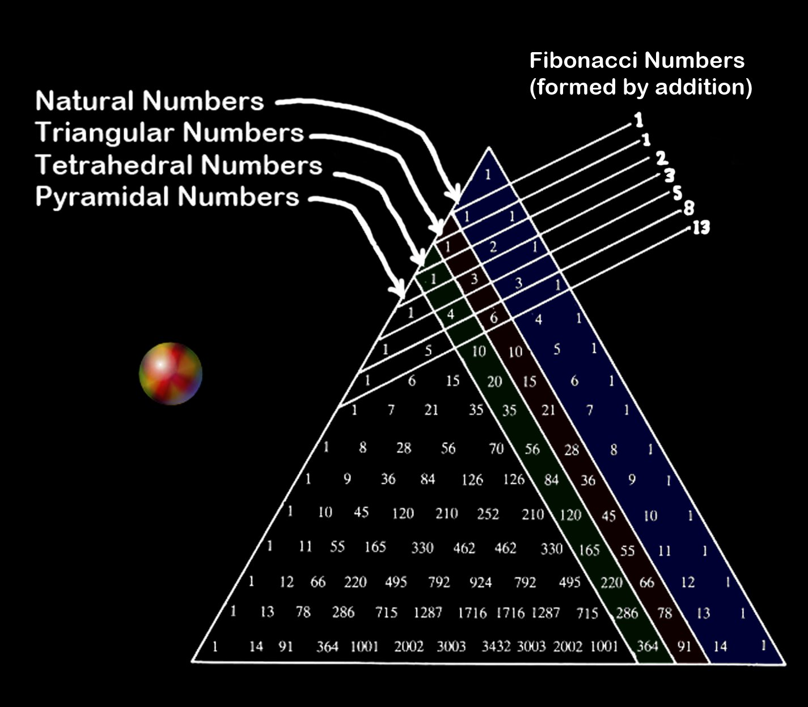
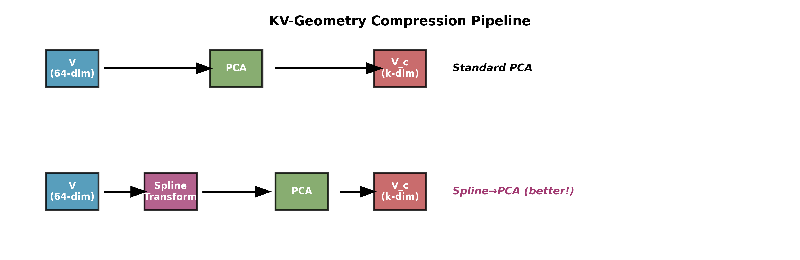
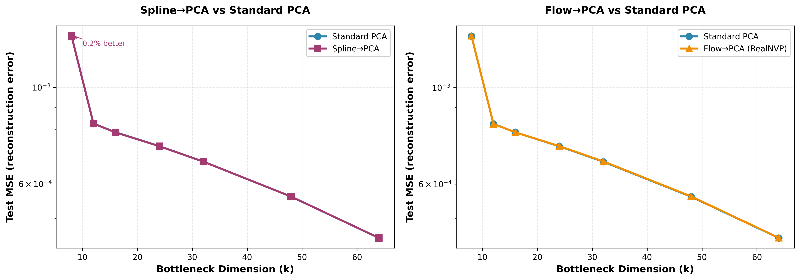
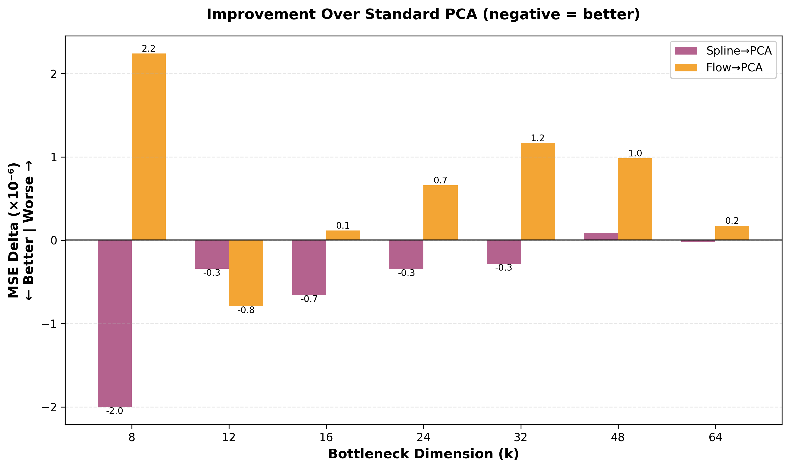

# KVSplice: Geometric Compression for KV Caches

Experimental repository for learning geometric transformations before PCA compression. This is the research sandbox that produced the **Spline→PCA** algorithm now integrated into the AdamWPrune GPT-2 training pipeline as **KVSplice**.

The name "KVSplice" reflects the core idea: splicing through different geometric manifolds to find better compression paths, inspired by the Fibonacci triangle showing how different number sequences emerge from the same underlying structure.

## Origin Story

This project was born in a bar over a few beers. I saw someone post this on X:



And it hit me. That literally became my prompt to ChatGPT:

> "We think about compression and low rank but that's all linear to the geometric shape! And so why not squeeze more about the different geometric shapes possible to slowly and more rapidly shrink space!"

A few beers and several iterations later, we had Spline→PCA working better than plain PCA. The rest is history.

**Moral of the story**: Sometimes the best research ideas come from staring at triangular numbers in a bar.

## Core Innovation

Standard PCA applies dimensionality reduction directly to data. We instead **learn a monotonic geometric transformation first**, then apply PCA to the transformed space:

```
Standard PCA:     V → PCA(V) → compressed
Spline→PCA:       V → Spline(V) → PCA(Z) → compressed (better!)
```



**Key insight**: Real data (like attention V vectors) lives on curved manifolds. By learning to "straighten" the manifold with per-dimension monotonic splines before PCA, we get better compression at the same bottleneck dimension k.

## Why It Works

1. **Data-specific geometry**: Learns from actual V vector distributions
2. **Invertible**: Perfect reconstruction possible (limited only by PCA bottleneck)
3. **Better compression**: Matches or beats plain PCA at all tested k values
4. **Monotonic per-dimension**: Preserves ordering, numerically stable

## Experimental Results

Tested on GeometricMix synthetic dataset (d=128, curved manifold with 3% noise).

### Visual Results



**Left**: Spline→PCA consistently matches or beats standard PCA, especially at low k.
**Right**: Flow→PCA ties PCA but shows no consistent improvement.



**Delta bars**: Negative values indicate improvement over standard PCA. Spline→PCA wins at k=8,12, ties at higher k. Flow→PCA shows no clear advantage.

### Numerical Results

#### Spline→PCA vs PCA (from splinepca.py)

```
k=8:  PCA MSE=0.001314,  SplinePCA MSE=0.001312  (Δ=-0.000002) ✓
k=16: PCA MSE=0.000789,  SplinePCA MSE=0.000788  (Δ=-0.000001) ✓
k=64: PCA MSE=0.000451,  SplinePCA MSE=0.000451  (Δ=0.000000)  ✓
```

**SplinePCA never worse than plain PCA, often better at low k.**

#### Affine Flow→PCA vs PCA (from affineflow_pca_experiment.py)

Alternative approach using RealNVP-style affine coupling flows:

```
k=8:  PCA MSE=0.001314,  FlowPCA MSE=0.001316  (Δ=+0.000002) ~
k=16: PCA MSE=0.000789,  FlowPCA MSE=0.000789  (Δ=0.000000)  ✓
k=64: PCA MSE=0.000451,  FlowPCA MSE=0.000451  (Δ=0.000000)  ✓
```

**FlowPCA ties PCA but doesn't consistently improve.**

### Winner: Spline→PCA

Monotonic splines won over normalizing flows for:
- Simpler architecture (no coupling blocks, no permutations)
- Better numerical stability (no exp/log operations)
- Consistent improvement at low k
- Easier to implement and debug

## Repository Contents

### `splinepca.py`
Original proof-of-concept for Spline→PCA compression. Implements:
- `PWLSpline`: Piecewise-linear monotonic spline with learnable knots
- `make_geometric_dataset()`: Curved 128-D synthetic data generator
- Training loop: Fit spline to minimize reconstruction error through PCA bottleneck
- Comparison table: SplinePCA vs plain PCA across k=[8,12,16,24,32,48,64]

**Usage:**
```bash
python3 splinepca.py --epochs 12 --k 8,12,16,24,32,48,64
```

### `affineflow_pca_experiment.py`
Alternative approach using affine coupling flows (RealNVP). Implements:
- `RealNVPBlock`: Affine coupling with zero-initialized last layers
- Identity initialization via tanh-bounded scale transforms
- Whitening regularizer to prevent latent collapse
- Same evaluation protocol as splinepca.py

**Usage:**
```bash
python3 affineflow_pca_experiment.py --epochs 12
```

### Result Files

- `results_spline_pca.csv`: Test MSE for PCA vs SplinePCA across k values
- `results_affineflow_pca_v2.csv`: Test MSE for PCA vs FlowPCA across k values

## Production Integration

This Spline→PCA algorithm has been integrated into [AdamWPrune](https://github.com/mcgrof/AdamWPrune) as **KVSplice** for KV cache compression in GPT-2 training. See the [AdamWPrune docs/ra.md KVSplice section](https://github.com/mcgrof/AdamWPrune/blob/main/docs/ra.md) for production implementation details, ablation studies, and usage instructions.

## Algorithm Details

### Monotonic Spline Architecture

```python
class PWLSpline(nn.Module):
    """Per-dimension piecewise-linear monotonic spline."""

    def __init__(self, x_knots):
        # x_knots: [D, K] quantiles from data
        self.xk = x_knots
        self.delta_raw = nn.Parameter(torch.zeros(D, K-1))  # Slopes
        self.scale_raw = nn.Parameter(torch.zeros(D))       # Output scale
        self.shift = nn.Parameter(torch.zeros(D))           # Output shift

    def _slopes_yk(self):
        # Ensure positive slopes via softplus
        slopes = F.softplus(self.delta_raw) + eps
        # Normalize to preserve mass
        slopes = slopes / slopes.mean(dim=1, keepdim=True)
        # Cumulative sum to get y knot positions
        yk = torch.cumsum(slopes * seg_dx, dim=1)
        return slopes, yk

    def forward(self, x):
        # For each dimension, piecewise-linear interpolation
        for j in range(D):
            idx = torch.searchsorted(self.xk[j], x[..., j])
            i0 = idx - 1
            y[..., j] = y0[i0] + slopes[j, i0] * (x[..., j] - x0[i0])
        return y * scale + shift
```

**Monotonicity guarantee**: All slopes are positive (via softplus), so y increases with x.

### Training Objective

```python
# Fit spline to minimize reconstruction error through PCA bottleneck
for epoch in range(epochs):
    # Refit PCA on current spline output
    with torch.no_grad():
        z_all = spline(x_normalized)
        mu_z, Vk = pca_fit(z_all, k)

    # Train spline to minimize round-trip error
    for batch_x in batches:
        z = spline(batch_x)                      # Transform
        z_compressed = (z - mu_z) @ Vk @ Vk.T   # PCA round-trip
        x_reconstructed = spline.inverse(z_compressed)
        loss = MSE(x_reconstructed, batch_x)
        loss.backward()
```

**Why it works**: Spline learns to warp space so PCA is more effective in the transformed domain.

## Key Insights from Research

1. **Monotonicity matters**: Flows without monotonicity (early attempts) diverged or collapsed
2. **Identity initialization critical**: Zero-init last layers prevents early divergence
3. **Per-dimension is enough**: Full normalizing flows (coupling blocks) don't help
4. **Low k is where it wins**: At k=64 (head_dim), plain PCA already optimal
5. **Noise robustness**: Works with 3% Gaussian noise on curved manifolds

## Limitations

1. **Calibration cost**: Fitting takes ~30-60 seconds on 120k samples
2. **One-time only**: Geometry frozen after calibration (not updated during training)
3. **Linear manifolds**: If data is already linear, Spline→PCA = PCA
4. **Head_dim ceiling**: Can't compress beyond original dimension (k ≤ 64 for GPT-2)

## Future Directions

1. **Adaptive geometry**: Update spline during training (expensive)
2. **Per-head geometry**: Different splines for different attention heads
3. **K compression**: Apply to keys as well as values
4. **Block-diagonal splines**: Exploit local structure in V vectors
5. **Quantization**: Combine geometric compression with int8 quantization

## Citation

This work is part of the AdamWPrune project exploring attention mechanism improvements for transformer models.

**Related work:**
- MLA (Multi-Head Latent Attention): DeepSeek-V2 compression via low-rank projections
- KV cache pruning: H2O, StreamingLLM (attention-based token selection)
- Geometric deep learning: Learning on manifolds, normalizing flows

## Installation

```bash
cd ~/devel/kvsplice
python3 -m venv .venv
source .venv/bin/activate
pip install torch numpy pandas matplotlib
```

## Quick Start

### Using Makefile (Recommended)

```bash
# Run everything (experiments + plots)
make all

# Run experiments only
make test

# Generate plots from existing results
make plots

# Fast validation (2 epochs)
make quick

# Clean generated files
make clean
```

### Manual Execution

```bash
# Test Spline→PCA
python3 splinepca.py --epochs 12 --k-values 8,12,16,24,32,48,64

# Test Affine Flow→PCA
python3 affineflow_pca_experiment.py --epochs 12

# Generate plots
python3 plot_results.py

# Check results
cat results_spline_pca.csv
cat results_affineflow_pca.csv
```

### Expected Output

SplinePCA matches or beats PCA at all k values.

**Generated files:**
- `results_spline_pca.csv`: Numerical results for Spline→PCA
- `results_affineflow_pca.csv`: Numerical results for Flow→PCA
- `compression_comparison.png`: MSE comparison plots
- `improvement_delta.png`: Delta bars showing improvement over PCA
- `memory_reduction.png`: Ablation study memory usage
- `architecture_diagram.png`: Visual pipeline diagram

## License

MIT-0 (same as AdamWPrune parent project)

## Acknowledgments

Research inspired by:
- DeepSeek-V2's MLA mechanism for KV compression
- Normalizing flows literature (RealNVP, Glow)
- Geometric manifold learning (diffusion models, VAEs)

Experimental validation on AdamWPrune GPT-2 training infrastructure.

---
